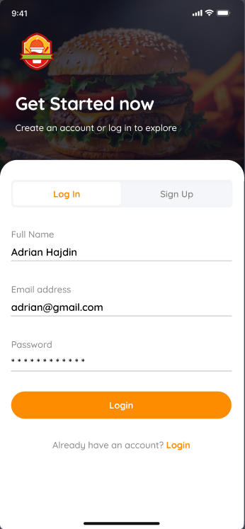
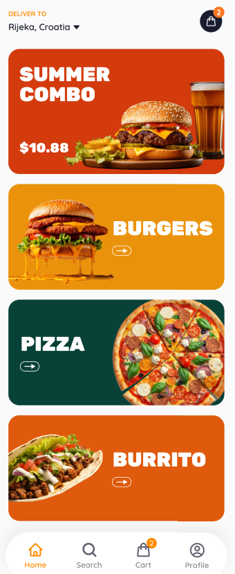
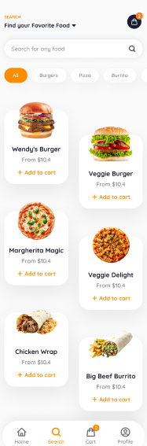
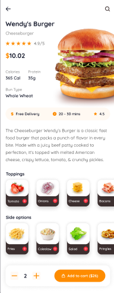
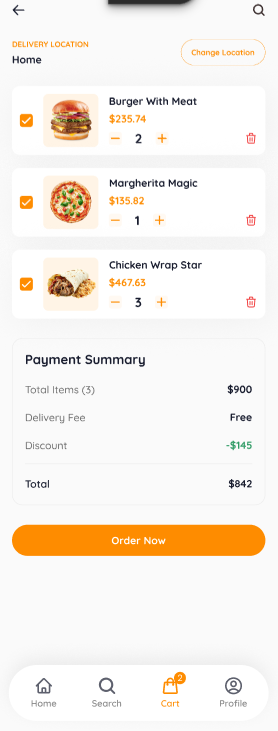
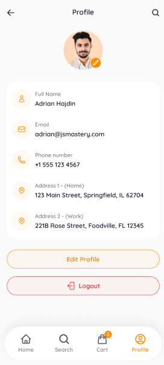

<div align="center">

# 🍔 Fooders

A modern cross-platform **Food Delivery Application** built with **React Native**, **Expo**, **TypeScript**, **Appwrite**, **NativeWind**, and **Zustand**.


<br/>


</div>

---

# 📋 Table of Contents

- [Introduction](#-introduction)
- [Screenshots](#-screenshots)
- [Features](#-features)
- [Tech Stack](#-tech-stack)
- [Installation](#-installation)
- [Environment Variables](#-environment-variables)
- [Running the Project](#-running-the-project)
- [Future Enhancements](#-future-enhancements)

---

# 🤖 Introduction

**Fooders** is a modern food delivery application that enables users to authenticate securely, browse restaurants and food items, search meals, manage their shopping cart, and place orders through an intuitive mobile experience.

Powered by **Appwrite** for authentication, backend services, and database management, and built using **React Native**, **Expo**, **TypeScript**, and **NativeWind**, Fooders delivers a fast, scalable, and responsive cross-platform experience for Android and iOS.

---

# 📱 Screenshots

<table align="center">
<tr>

<td align="center">
<b>🔐 Login</b><br/><br/>

</td>

<td align="center">
<b>✅ Login Success</b><br/><br/>

</td>

<td align="center">
<b>🏠 Home</b><br/><br/>

</td>

<td align="center">
<b>🔍 Search</b><br/><br/>

</td>

</tr>

<tr>

<td align="center">
<b>🍽️ Food Details</b><br/><br/>

</td>

<td align="center">
<b>🛒 Cart</b><br/><br/>

</td>

<td align="center">
<b>👤 Profile</b><br/><br/>

</td>

<td align="center">
<b>📦 Orders</b><br/><br/>

</td>

</tr>
</table>

---

# 🔥 Features

### 🔐 Secure Authentication

Authenticate users securely using **Appwrite Authentication** with a seamless login experience.

---

### 🏠 Home Dashboard

Browse featured restaurants, popular meals, and the latest food offers through a clean, modern interface.

---

### 🔍 Smart Food Search

Search meals instantly with category filtering and keyword-based search functionality.

---

### 🍽️ Food Details

View detailed information including food images, pricing, descriptions, ingredients, and ratings before placing an order.

---

### 🛒 Shopping Cart

Add, remove, and manage food items with automatic total price calculation.

---

### 👤 User Profile

Manage personal information, account preferences, and order history.

---

### ☁️ Appwrite Backend

Utilizes Appwrite for:

- Authentication
- Database Management
- File Storage
- Backend Services

---

### ⚡ Global State Management

Uses **Zustand** for lightweight and efficient application-wide state management.

---

### 🎨 Modern Mobile UI

- Beautiful Interface
- Responsive Design
- Smooth Navigation
- Mobile-First Experience
- Consistent User Experience

---

### 📱 Cross-Platform Support

Developed using React Native and Expo to provide a seamless experience on Android and iOS.

---

### 🏗️ Scalable Architecture

Built with:

- Reusable Components
- TypeScript Interfaces
- Modular Services
- Utility Functions
- Clean Folder Structure
- Separation of UI and Business Logic

---

### 🚀 Optimized Performance

- Efficient Rendering
- Fast Navigation
- Optimized API Calls
- Lightweight State Management
- Responsive Interactions

---

# ⚙️ Tech Stack

- React Native
- Expo
- Expo Router
- TypeScript
- NativeWind
- Appwrite
- Zustand
- Sentry

---

# 🚀 Installation

Clone the repository.

```bash
git clone https://github.com/<your-github-username>/fooders.git

cd fooders
```

Install dependencies.

```bash
npm install
```

or

```bash
yarn
```

---

# 🔑 Environment Variables

Create a `.env` file in the project root.

```env
EXPO_PUBLIC_APPWRITE_PROJECT_ID=

EXPO_PUBLIC_APPWRITE_ENDPOINT=
```

Replace the placeholder values with your Appwrite project credentials.

---

# ▶️ Running the Project

Start the Expo development server.

```bash
npx expo start
```

Run on Android.

```bash
npx expo run:android
```

Run on iOS.

```bash
npx expo run:ios
```

Or scan the QR code using **Expo Go** on your mobile device.

---

# 🚀 Future Enhancements

- 💳 Online Payment Integration
- ❤️ Wishlist & Favorites
- 📍 Live Order Tracking
- 🔔 Push Notifications
- ⭐ Restaurant Reviews
- 🧾 Order History
- 🎁 Coupons & Discounts
- 🌙 Dark Mode
- 🤖 AI Food Recommendations
- 🌎 Multi-language Support

---

<div align="center">

### ⭐ If you found this project useful, consider giving it a star!

Made with ❤️ using **React Native**, **Expo**, **TypeScript**, **NativeWind**, **Appwrite**, and **Zustand**.

</div>
